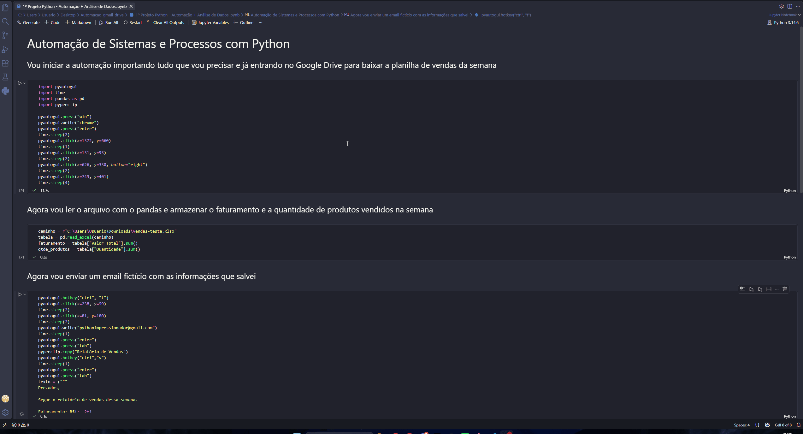

# Automação de Sistemas e Processos com Python

## Cenário

Imagine que você é um analista de dados de uma empresa de vendas. Toda semana, uma nova planilha de vendas chega no Google Drive, e você precisa extrair os resultados principais e enviar um relatório por e-mail ao seu chefe.

Este projeto automatiza exatamente esse processo, do download ao envio do e-mail, sem nenhuma intervenção manual.

## O que o projeto faz

1. Acessa o Google Drive e baixa a planilha de vendas da semana;
2. Lê e processa os dados com pandas;
3. Calcula o faturamento total e a quantidade de produtos vendidos;
4. Abre o Gmail e envia o relatório automaticamente para o destinatário.

## Ferramentas utilizadas

- `pyautogui` — automação de mouse e teclado;
- `pandas` — leitura e processamento da planilha;
- `pyperclip` — manipulação da área de transferência;
- `time` — controle de pausas e tempo de execução;

## Demonstração

## Observações

- Todos os dados são fictícios, criados apenas para fins de estudo;
- Nenhuma informação pessoal real é usada ou exposta no projeto;
- A automação utiliza uma conta de testes separada.

## Créditos

Projeto desenvolvido durante meu aprendizado de Python, com base em um projeto proposto no curso da [Hashtag Treinamentos](https://www.hashtagtreinamentos.com/).